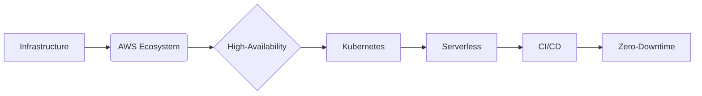

#  Izhar Hussain  
### Co-Founder & Managing Director @ Cygen Solutions | AI Systems Architect | Cloud Strategist

> Bridging cutting-edge AI research with enterprise-grade solutions since 2020


---

## 🧠 AI-Driven Value Creation

I architect intelligent systems that transform industries through **applied AI innovation**. At Cygen Solutions, I lead development of platforms that redefine:

- **Enterprise Communications** (VoiceInfra.ai)  
- **Adaptive Learning** (SmartPrep.Tech)  
- **Secure Assessment** (Examify.net)  

*"Turning theoretical AI potential into measurable business impact"*

---

## ⚡ Core Competencies

### 🤖 AI/ML Engineering
| **Specialization**         | **Technologies**                          |
|----------------------------|-------------------------------------------|
| LLM Development            | Transformer Architectures • Fine-tuning   |
| NLP Systems                | BERT • GPT • RAG Pipelines               |
| MLOps                     | Kubeflow • MLflow • SageMaker            |
| AI Automation              | LangChain • Autonomous Agents            |

### ☁️ Cloud-Native Systems


### 🧭 Strategic Leadership
- Cross-functional team leadership (15+ engineers)  
- AI product strategy from concept to market dominance  
- Technical due diligence for SaaS investments  
- Enterprise architecture for regulated industries
  
---

## 🎓 Academic Foundation

**MSc Software Engineering**  
*University of Malaya | Specialization: AI/ML Systems*  
- Thesis: *"Lifecycle Models for ML-Based Production Systems"*  
- Research: Optimizing transformer models for telecom datasets  

**BSc Software Engineering**  
*Gold Medalist | Graduated with Highest Honors*  

---

## 🌌 Beyond Technology

 **Classic Literature Connoisseur**  
Dostoevsky • Hugo • Dickens • Tolstoy  
*Finding parallels between complex character development and system architecture*

 **Innovation Philosophy**  
*"The best AI systems emerge when mathematical precision meets human narrative"*

---

## 🤝 Strategic Engagement Opportunities

I partner with organizations seeking to:

- Implement AI transformation roadmaps  
- Architect cloud-native solutions at scale  
- Develop competitive AI product strategies  
- Optimize MLOps pipelines for enterprise  

**Advisory Roles Open For**  
```diff
+ AI Strategy Consulting
+ Technical Advisory Board Positions
+ Cloud Architecture Partnerships
+ Enterprise AI Implementation
```

---

## 📡 Connect With Me

[](https://www.linkedin.com/in/ixxhar)
[](mailto:izhar@cygen.solutions)
[](https://www.cygen.solutions)

> "Architecting tomorrow's intelligent enterprises - today"
